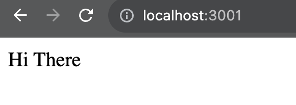
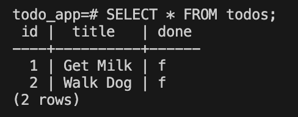
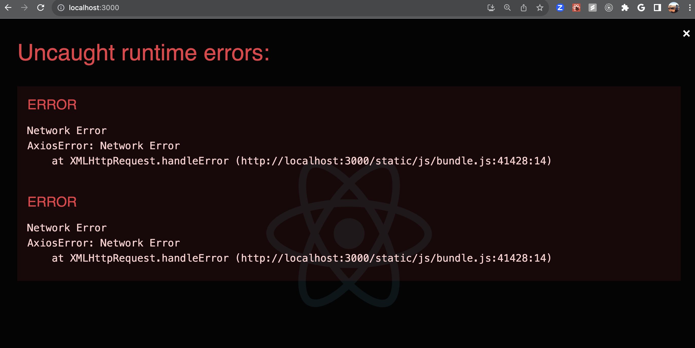
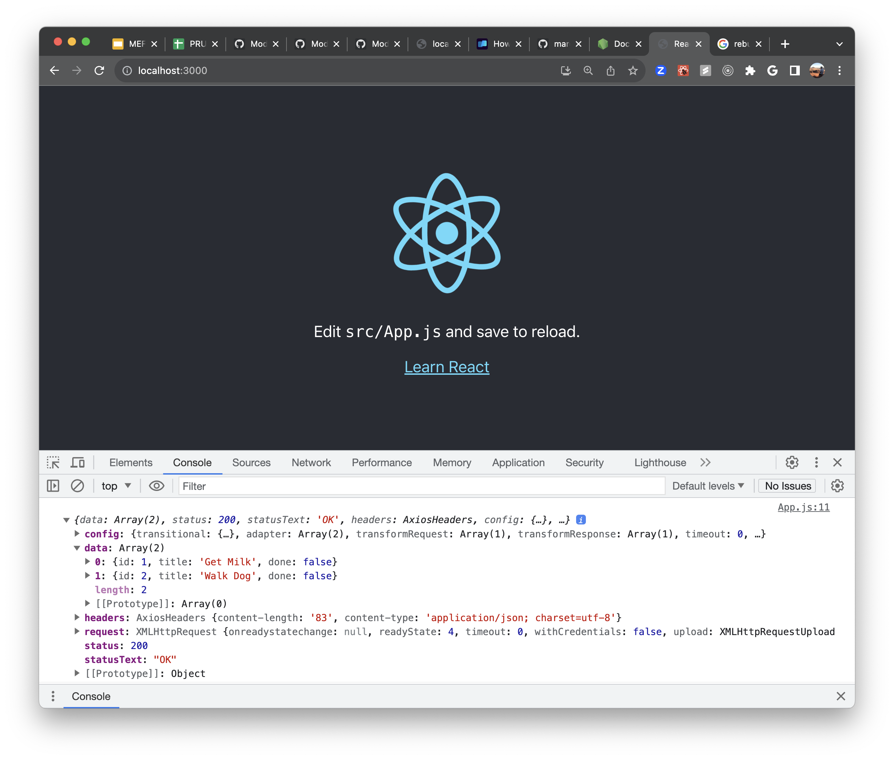

## Dockerize the Todo App

1. Make sure Docker is running and Postgres is turned off.

    - To stop postgres in the VM run `sudo service postgresql stop`
    - To start Docker run `sudo service docker start`

## Dockerfile for Node Express Backend

1. Note that inside the `starter_todo_app`, we've renamed the node express todo app folder `backend`.
1. Create a `Dockerfile` in the `starter_todo_app/backend` folder: `touch Dockerfile`

    ```dockerfile
    FROM node:alpine
    # This is the image we'll use as the base

    WORKDIR /usr/src/app
    # Create app directory

    COPY . .
    # Copy the app to the directory

    RUN npm install
    # Install dependencies

    EXPOSE 3001
    # The port we want the container to open (i.e. run on)

    CMD [ "npm", "run", "start" ]
    # The command to start the server inside the container      
    ```

1. Add a `.dockerignore` file for files and folders we don't want to copy into the container:

    ```
    node_modules
    npm-debug.log
    ```

1. To build the image: `docker build . -t backend`

    - The `-t` flag lets us tag the image so it's easier to find.

1. To run the image in a container: `docker run -d --name backend-container -p 3001:3001 backend`

    - The `-p` flag defines the local port and the container port. These can be different.
    - The `--name` flag lets us name the container
    - `backend` is the name of the image
    - To view the server logs remove the `-d` flag (quite mode) after `docker run`

1. You can run `docker ps` to check our the list of running containers.

1. To stop the running container: `docker stop backend-container`. You can stop any other container with the `NAMES` or the first few characters of the `CONTAINER_ID`.

1. To start the container: `docker start backend-container`. You can start any other container with the `NAMES` or the first few characters of the `CONTAINER_ID`.

1. Go to `localhost:3001` in the browser. We should see the same "Hi There" message as running the app locally.

    

## Dockerfile the Postgres Database

1. Note that inside the `starter_todo_app`, we've renamed the node express todo app folder `backend`.
1. Inside the `starter_todo_app/backend/db` folder create a `Dockerfile` (from inside the `backend` folder): `touch db/Dockerfile`

    ```dockerfile
    FROM postgres
    # This is the image we'll use as the base

    ENV POSTGRES_PASSWORD docker
    # This is the password we'll define for the Docker Postgres instance

    ENV POSTGRES_DB todo_app
    # This is what we'll name the database inside the container

    COPY todo.sql /docker-entrypoint-initdb.d/
    # Copy the todo.sql file to the listed path in the container
    # This will create the todos table and add some todos
    ```

1. To build the image (if you're in the `backend/db` directory): `docker build . -t db`
1. To run the image in a container: `docker run -d --name db-container -p 5432:5432 db`

1. To confirm that we created the table and added some todos:

    - `docker exec -it db-container bash`
        - This will get us into the container itself
    - `psql todo_app_db -h localhost -U postgres`
        - This will enter the `psql` shell
    - `SELECT * FROM todos;`
        - Get all the todos

    

## Dockerfile for the React frontend

1. We've renamed the React todo app folder `frontend`.
1. Create a `Dockerfile`: `touch Dockerfile`

    ```dockerfile
    FROM node:alpine
    # This is the image we'll use as the base

    WORKDIR /usr/src/app
    # Create app directory

    COPY . .
    # Copy the app to the directory

    RUN npm install
    # Install dependencies

    EXPOSE 3001
    # The port we want the container to open (i.e. run on)

    CMD [ "npm", "run", "start" ]
    # The command to start the server inside the container      
    ```

1. Add a `.dockerignore` file for files and folders we don't want to copy into the container:

    ```
    node_modules
    npm-debug.log
    ```

1. To build the image: `docker build . -t frontend`

    - The `-t` flag lets us tag the image so it's easier to find.

1. To run the image in a container: `docker run -d --name frontend-container -p 3000:3000 frontend`

    - The `-p` flag defines the local port and the container port. These can be different.
    - The `--name` flag lets us name the container
    - `frontend` is the name of the image
    - To view the server logs remove the `-d` flag after `docker run`

1. To start a container: `docker start frontend-container`

1. To stop a running container: `docker stop frontend-container`

1. Go to `localhost:3000` in the browser. The good new is that our containers are working, however, you will probably see an error. That's because the Dockerized Express backend is having difficutly communicating with the Dockerized Postgres database (this has to do with how Docker handles `localhost`). We will fix this next!

    

## Docker Compose

1. To install Docker Compose, run `sudo pip install docker-compose`

    - [To troubleshoot, try this article](https://phoenixnap.com/kb/install-docker-compose-centos-7)

1. In the root of the `starter_todo_app` folder (where the `backend` and `frontend` folders are) run `touch docker-compose.yml`

    ```dockerfile
    version: '3.3'
    services:
        backend:
            container_name: backend-container
            restart: always
            ports:
                - '3001:3001'
            depends_on:
                - db
            build:
                dockerfile: Dockerfile
                context: "./backend"
            links: # in the backend/index.js file make sure to update host: 'db'
                - db 

        db:
            container_name: db-container
            restart: always
            tty: true
            volumes:
                - ./data:/var/lib/postgresql/data
            ports:
                - '5432:5432'
            build:
                dockerfile: Dockerfile
                context: "./backend/db"

        frontend:
            container_name: frontend-container
            restart: always
            ports:
                - '3000:3000'
            build:
                dockerfile: Dockerfile
                context: "./frontend"
            depends_on:
            - backend
            - db
    ```

    - NOTE: if you get an error, make sure that your blocks are indented correctly in the file.

1. In `backend/index.js` confirm the `password` and `host` in the `pool`:

    ```js
    const pool = new Pool({
        user: 'postgres',
        host: 'db',
        database: 'todo_app_db',
        password: 'postgres',
        port: 5432,
    })
    ```

1. Let's stop and remove all containers: `docker rm -f $(docker ps -a -q)`

    - or try `docker ps -aq | xargs docker stop | xargs docker rm`

1. `docker-compose up -d --build`

Now when you go into the React browser console you should see some todos:



1. Run `docker compose down` to stop the running containers.

## YOU DO

Now that you have your containers orchestrated, try your Postman collection requests again.
