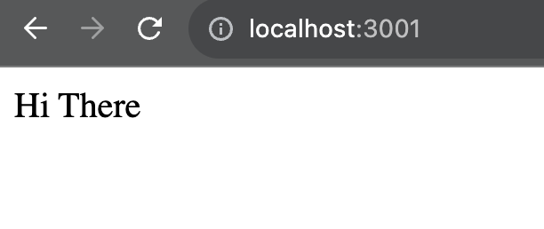
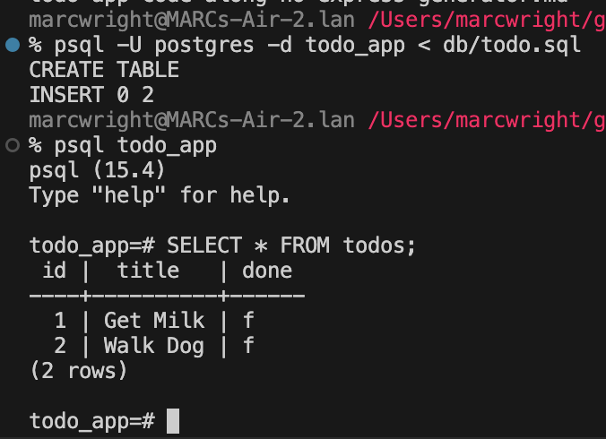
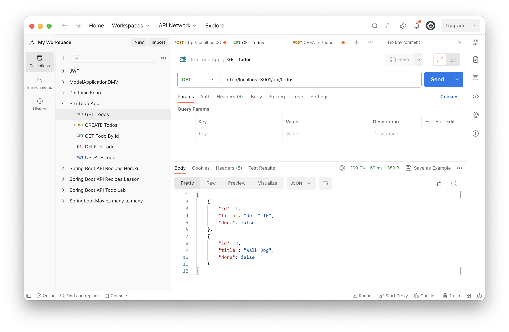
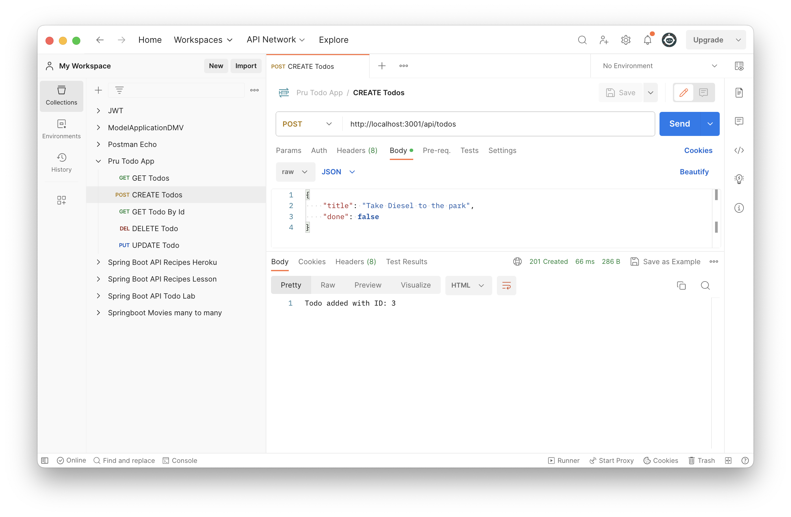
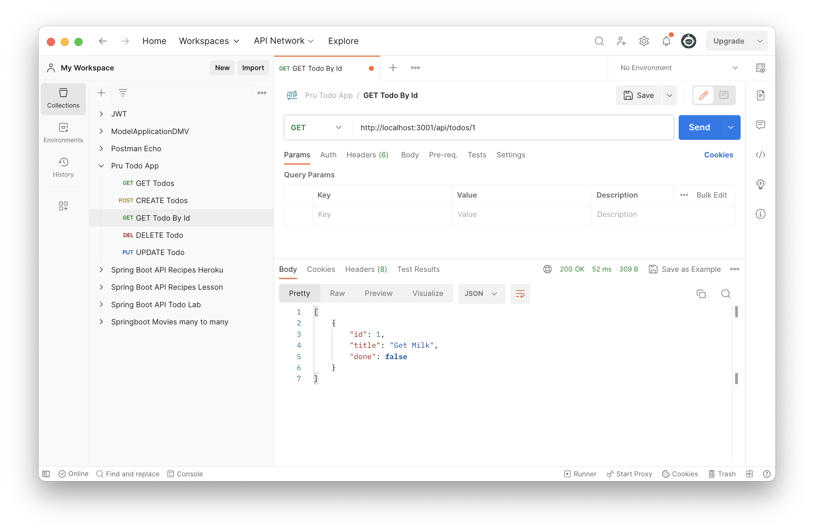
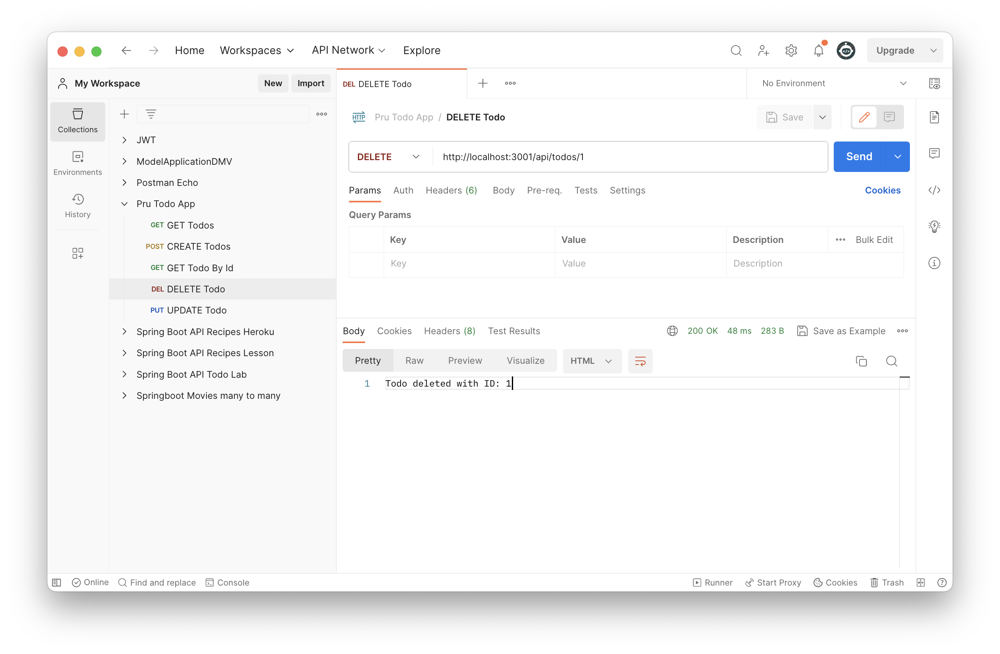
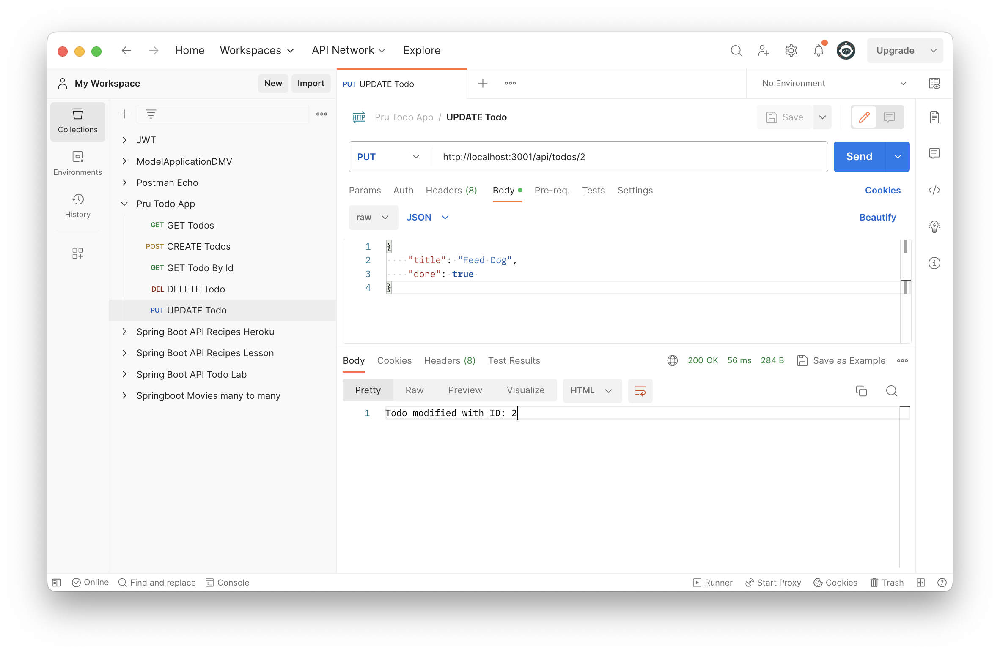

## TODO Express API App

Let's build our own Node/Express API and test it out with Postman. We will use a PostgreSQL datastore and write raw SQL to query the database.

There is a Postman collection in this folder that contains the endpoints we'll build: `Pru_Todo_App.postman_collection.json`

## No Generator

1. `mkdir todo-app-no-generator`
1. `cd todo-app-no-generator`
1. `npm init -y`
1. `npm i cors express pg nodemon`
1. `touch index.js`

    ```js
    const express = require('express');
    const cors = require('cors');
    const Pool = require('pg').Pool
    const pool = new Pool({
      user: 'postgres',
      host: 'localhost',
      database: 'todo_app_db',
      password: '',
      port: 5432,
    })

    const app = express();
    app.use(cors())
    app.use(express.json())
    app.use(express.urlencoded({ extended: true }));

    app.get('/', (req, res) => {
      res.send('Hi There')
    });

    app.listen('3001', () => { })
    ```

1. In `package.json` let's update the start script to use `nodemon`. This wa we don't have to stop and restart the server each time we make a change to our code.

    ```js
    "scripts": {
      "start": "nodemon index.js"
    },
    ```

1. To start the server, run `npm run start`. Go to `localhost:3001` in the broswer. you should see this:

    

## Create the todos Database

1. `mkdir db`
1. `touch db/todo.sql`

    ```sql
    CREATE TABLE todos (
      ID SERIAL PRIMARY KEY,
      title VARCHAR(50),
      done BOOLEAN
    );

    INSERT INTO todos (title, done)
    VALUES ('Get Milk', false), ('Walk Dog', false);    
    ```

1. Let's create the database: `createdb todo_app`

1. Run the sql file to create the table and add 2 todos: `psql -U postgres -d todo_app < db/todo.sql`

1. To confirm this, we can check the `todo_app` database from inside the `psql` shell: `psql todo_app`

1. `SELECT * FROM todos;`

    


## GET TODOS

1. You'll see a pattern here. First, we'll define an HTTP verb then define a method in the `queries.js` file to execute the operation. In `app.js`:

    ```js
    app.get('/api/todos', (request, response) => {
        pool.query('SELECT * FROM todos ORDER BY id ASC', (error, results) => {
            if (error) throw error;

            console.log(results)
            response.status(200).json(results.rows)
        })
    })
    ```

1. Be sure to test this out in Postman with the provided collection of queries.

  

## CREATE A TODO

1. `app.js`

    ```js
    app.post('/api/todos', (request, response) => {
        const { title, done } = request.body

        pool.query('INSERT INTO todos (title, done) VALUES ($1, $2) RETURNING *', [title, done], (error, results) => {
            if (error) throw error;
            console.log(results)
            response.status(201).send(`Todo added with ID: ${results.rows[0].id}`)
        })
    });
    ```

1. Be sure to test this out in Postman with the provided collection of queries.

  


## GET SINGLE TODO

1. `app.js`

    ```js
    app.get('/api/todos/:id', (request, response) => {
        const id = parseInt(request.params.id)
      
        pool.query('SELECT * FROM todos WHERE id = $1', [id], (error, results) => {
            if (error) throw error;
            response.status(200).json(results.rows)
        })
    });
    ```

1. Be sure to test this out in Postman with the provided collection of queries.

  


## DELETE TODO

1. `app.js`

    ```js
    app.delete('/api/todos/:id', (request, response) => {
        const id = parseInt(request.params.id)
      
        pool.query('DELETE FROM todos WHERE id = $1', [id], (error, results) => {
            if (error) throw error;
            response.status(204).send(`Todo deleted with ID: ${id}`)
        })
    });
    ```

1. Be sure to test this out in Postman with the provided collection of queries.

  


## UPDATE TODO

1. `app.js`

    ```js
    app.put('/api/todos/:id', (request, response) => {
        const id = parseInt(request.params.id)
        const { title, done } = request.body
      
        pool.query(
          'UPDATE todos SET title = $1, done = $2 WHERE id = $3',
          [title, done, id],
          (error, results) => {
            if (error) throw error;
            response.status(200).send(`Todo modified with ID: ${id}`)
        })
    });
    ```

1. Be sure to test this out in Postman with the provided colleciton of queries.

  

## Add CORS

Our app is working fine with Postman. However, when we build a React font-end app to consume our API we're gonna get [CORS errors](https://www.contentstack.com/docs/developers/how-to-guides/understanding-and-resolving-cors-error/). 

We went ahead and pre-emptively took care of this.

1. `npm install cors`
1. `app.js`

    ```js
    const cors = require('cors')
    app.use(cors())
    ```

## References

- https://expressjs.com/en/starter/generator.html
- https://blog.logrocket.com/crud-rest-api-node-js-express-postgresql/#creating-postgresql-database
- https://git.generalassemb.ly/prudential-0921/installfest